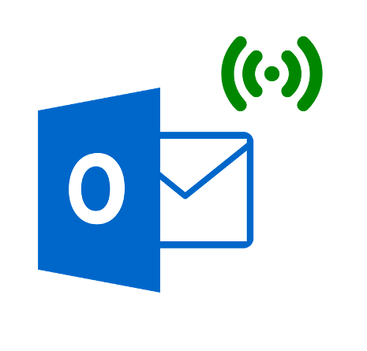
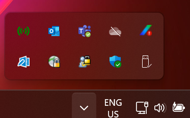
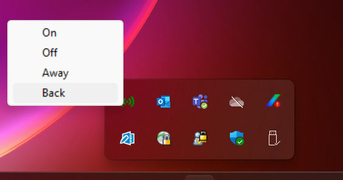

<div id="top"></div>

<!-- PROJECT SHIELDS -->
<!--
*** I'm using markdown "reference style" links for readability.
*** Reference links are enclosed in brackets [ ] instead of parentheses ( ).
*** See the bottom of this document for the declaration of the reference variables
*** for contributors-url, forks-url, etc. This is an optional, concise syntax you may use.
*** https://www.markdownguide.org/basic-syntax/#reference-style-links
-->
[![MIT License][license-shield]][license-url]


<!-- PROJECT LOGO -->
<br />
<div align="center">
  <a href="https://github.com/kliam11/outlook-auto-status">
    
  </a>

<h3 align="center">Outlook Automated Status</h3>

  <p align="center">
    Windows system-tray component for automating telework status emails on Outlook. 
    <br />
    <br />
    ·
    <a href="https://github.com/kliam11/outlook-auto-status/issues">Report Bug</a>
  </p>
</div>


<!-- TABLE OF CONTENTS -->
<details>
  <summary>Table of Contents</summary>
  <ol>
    <li>
      <a href="#about-the-project">About The Project</a>
      <ul>
        <li><a href="#built-with">Built With</a></li>
      </ul>
    </li>
    <li>
      <a href="#getting-started">Getting Started</a>
      <ul>
        <li><a href="#prerequisites">Prerequisites</a></li>
        <li><a href="#installation">Installation</a></li>
      </ul>
    </li>
    <li><a href="#usage">Usage</a></li>
    <li><a href="#license">License</a></li>
  </ol>
</details>


<!-- ABOUT THE PROJECT -->
## About The Project

Some of workplaces require teleworkers to send status emails throughout the day detailing if they are online, gone for lunch, or logged off
for the day. This script simplifies this process by allowing Windows/Outlook users to send these emails by the click of button using a 
system tray application. 

### Built With

* Python 
* PyStray 
* PyWin32 

<p align="right">(<a href="#top">back to top</a>)</p>


<!-- GETTING STARTED -->
## Getting Started

### Prerequisites

requirements.txt contains the list of dependencies for this program. 

### Installation

1) Download the OutlookAuto.zip file. Unzip into a directory of your choice. 
2) Change the SEND_TO parameter in config.py to the recepient email address. 
3) Create a shortcut of the outlookauto.exe file in the following location: 
```
C:\Users\{USERNAME}\AppData\Roaming\Microsoft\Windows\Start Menu\Programs\Startup
```

<p align="right">(<a href="#top">back to top</a>)</p>


<!-- USAGE EXAMPLES -->
## Usage

This program is tested for use on Windows 11 systems. You must be logged into Outlook/Office365 on your machine. 

Once installed, the program icon will be visible on startup in the system tray: 



By right-clicking on the icon, you will see the options available. 



<!--_For more examples, please refer to the [Documentation](https://example.com)_ 
### FAQ  

-->


<!-- LICENSE -->
## License

Distributed under the MIT License. See `LICENSE.txt` for more information.

<p align="right">(<a href="#top">back to top</a>)</p>


<!-- MARKDOWN LINKS & IMAGES -->
<!-- https://www.markdownguide.org/basic-syntax/#reference-style-links -->
[license-shield]: https://camo.githubusercontent.com/111148992d0253f8d5e36b62087d48a9eabb1d7244b2b7316214f47d5c9a8781/68747470733a2f2f696d672e736869656c64732e696f2f6769746875622f6c6963656e73652f6f74686e65696c647265772f426573742d524541444d452d54656d706c6174652e7376673f7374796c653d666f722d7468652d6261646765
[license-url]: https://github.com/kliam11/outlook-auto-status/blob/main/LICENSE
[linkedin-shield]: https://img.shields.io/badge/-LinkedIn-black.svg?style=for-the-badge&logo=linkedin&colorB=555
